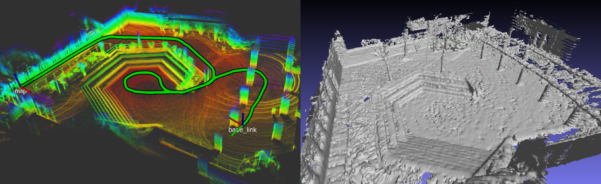

# HATSDF SLAM



- [HATSDF SLAM](#hatsdf-slam)
  - [Dependencies](#dependencies)
  - [Build](#build)
  - [Base Design](#base-design)
  - [Runtime Parameters](#runtime-parameters)
  - [Run](#run)
  - [Cite](#cite)

## Dependencies
* Ubuntu 18.04
* make
* Xilinx 2020.1
* Hardware Base Design [Pre-Built]() | [DIY]()
* qemu (Tests)
## Build
**Note**: `HW_TARGET=sw_emu` is now default, compile hardware with `HW_TARGET=hw`

1. Source Xilinx Tools: `source <XILINX_INSTALL_DIR>/settings64.sh`
2. Source Xilinx Runtime: `source /opt/xilinx/xrt/setup.sh`
3. Are specific board files copied? In FastSense repo, run `cp -r base_design/board_files/* <VIVADO_INSTALL_DIR>/data/boards/board_files/`
4. Compile project
    * software only? `make software -j4`
    * hardware only? `make hardware -j4`
    * tests (hw+sw)? `make test -j4`
    * test software only? `make test_software`
    * test hardware only? `make test_hardware`
5. Package SD card image (if HW_TARGET=sw_emu qemu launch script and image is generated)
    * HATSDF SLAM: `make package HW_TARGET=hw -j4`
    * Tests: `make package_test HW_TARGET=hw -j4`

## Base Design
You can either [download a pre built base-design]() for the specific board, or build it yourself. To do just that please follow the instructions in the [Base Design repository]().

## Runtime Parameters

All parameters are read when the program is started from the *config.json* located in *app_data/*. After copying the files to the SD card, this file should be copied into the */mnt* directory alongside the executable.

In the following, the runtime parameters are listed and described shorly:

* **imu**: Parameters for the IMU driver and the IMU average filter
  * **bufferSize**: Buffer size for the incoming imu data
  * **filterSize**: Size of the sliding window for the average filter
* **lidar**: Parameters for the LiDAR driver to configurate the network communication and the algorithm based on the properties of the laserscanner
  * **bufferSize**: Buffer size for the incoming LiDAR data
  * **port**: Port for the network communication of the sensor
  * **pointscale**: Scaling that should be applied on every point of the received cloud. This can indirectly adjust the resolution of the map without changing the hardware
  * **rings**: Expected scan rings in the received point clouds
  * **vertical_fov_angle**: Expected vertical field of view of the sensor (in degree)
* **registartion**: Parameters for the registration of the incoming sensor data based on the current TSDF map
  * **max_iterations**: Maximum number of iterations spent for every matching procedure
  * **it_weight_gradient**: Weight for the changing decay, increasing with every iteration 
  * **epsilon**: Registartion error from which the matching procedure should be stopped
* **gpio**: Parameters for the GPIO pins
* **bridge**: Parameters for the ROS bridge
  * **use_from**: Should the the sensor data be used from the ROS bridge?
  * **use_to**: Should the output data of the SLAM-Box be sent via the ROS bridge?
  * **send_original**: Send the unprocessed sensor data provided by the laserscanner 
  * **send_preprocessed**: Send the scaled and filtered sensor data
  * **send_after_registartion***: Send the registered sensor data
  * **host_from**: IP address of the host
  * **imu_port_from**: Port to receive IMU data from the host
  * **imu_port_to**: Port to send IMU data send data to the host
  * **pcl_port_from**: Port to receive point cloud data from the host
  * **pcl_port_to**: Port to send point cloud data to the host
  * **transform_port_to**: Port to send the current pose of the SLAM-Box to the host
  * **tsdf_port_to**: Port to send the local TSDF map to the host
* **slam**: Parameters for the mapping procedure
  * **max_distance**: Truncation value for the distance values in the TSDF map (in mm)
  * **map_size_x**: Size of the local TSDF map in x direction (in cells)
  * **map_size_y**: Size of the local TSDF map in y direction (in cells)
  * **map_size_z**: Size of the local TSDF map in z direction (in cells)
  * **max_weight**: Upper bound for the weights of every cell for the averaging
  * **initial_map_weight**: Initial weight for every cell in the TSDF map
  * **map_update_period**: Skipped scans until the next map update
  * **map_update_position_threshold**: Distance from which a new map update is to be performed
  * **map_path**: Save directory for the global map
  
Example:

```
{
    "imu": {
        "bufferSize": 16,
        "filterSize": 25
    },

    "lidar": {
        "bufferSize": 1,
        "port": 2368,
        "pointScale": 1.0,
        "rings": 16,
        "vertical_fov_angle": 30.0
    },

    "registration": {
        "max_iterations": 200,
        "it_weight_gradient": 0.1,
        "epsilon": 0.01
    },

    "gpio": {
        "button_chip": "gpiochip0",
        "button_line": 0,
        "led_chip": "gpiochip1",
        "led_line": 0
    },

    "bridge": {
        "use_from": true,
        "use_to": true,

        "send_original": false,
        "send_preprocessed": false,
        "send_after_registration": true,

        "host_from": "192.168.1.245",

        "imu_port_from": 4444,
        "imu_port_to": 5555,

        "pcl_port_from": 3333,
        "pcl_port_to": 7777,

        "transform_port_to": 8888,
        "tsdf_port_to": 6666
    },

    "slam": {
        "max_distance": 600,
        "map_size_x": 201,
        "map_size_y": 201,
        "map_size_z": 121,
        "max_weight": 10,
        "initial_map_weight": 0.0,
        "map_update_period": 100,
        "map_update_position_threshold": 500,
        "map_path": "/data"
    }
}
```

## Run

On the SoC:

```
cd /mnt
./FastSense.exe
```

## Cite

```
@inproceedings{eisoldt2021hatsdf,
  title={HATSDF SLAM--Hardware-accelerated TSDF SLAM for Reconfigurable SoCs},
  author={Eisoldt, Marc and Flottmann, Marcel and Gaal, Julian and Buscherm{\"o}hle, Pascal and Hinderink, Steffen and Hillmann, Malte and Nitschmann, Adrian and Hoffmann, Patrick and Wiemann, Thomas and Porrmann, Mario},
  booktitle={2021 European Conference on Mobile Robots (ECMR)},
  pages={1--7},
  year={2021},
  organization={IEEE}
}
```

```
@inproceedings{flottmann2021energy,
  title={Energy-efficient FPGA-accelerated LiDAR-based SLAM for embedded robotics},
  author={Flottmann, Marcel and Eisoldt, Marc and Gaal, Julian and Rothmann, Marc and Tassemeier, Marco and Wiemann, Thomas and Porrmann, Mario},
  booktitle={2021 International Conference on Field-Programmable Technology (ICFPT)},
  pages={1--6},
  year={2021},
  organization={IEEE}
}
```

```
@article{eisoldt2022fully,
  title={A fully integrated system for hardware-accelerated TSDF SLAM with LiDAR sensors (HATSDF SLAM)},
  author={Eisoldt, Marc and Gaal, Julian and Wiemann, Thomas and Flottmann, Marcel and Rothmann, Marc and Tassemeier, Marco and Porrmann, Mario},
  journal={Robotics and Autonomous Systems},
  volume={156},
  pages={104205},
  year={2022},
  publisher={Elsevier}
}

```

```
@incollection{eisoldt2021reconfros,
  title={Reconfros: Running ros on reconfigurable socs},
  author={Eisoldt, Marc and Hinderink, Steffen and Tassemeier, Marco and Flottmann, Marcel and Vana, Juri and Wiemann, Thomas and Gaal, Julian and Rothmann, Marc and Porrmann, Mario},
  booktitle={Proceedings of the 2021 Drone Systems Engineering and Rapid Simulation and Performance Evaluation: Methods and Tools Proceedings},
  pages={16--21},
  year={2021}
}
```

```
@article{wiemannenergieeffizientes,
  title={Energieeffizientes FPGA-basiertes TSDF-SLAM f{\"u}r Mobile Mapping},
  author={WIEMANN, Thomas and EISOLDT, Marc and FLOTTMANN, Marcel and GAAL, Julian and ROTHMANN, Marc and TASSEMEIER, Marco and PORRMANN, Mario}
}
```
